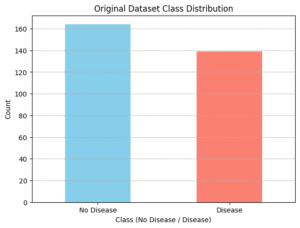
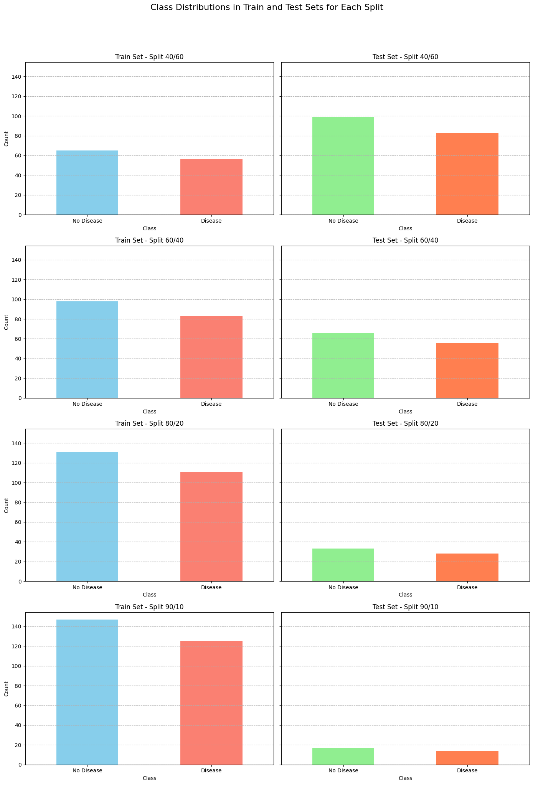
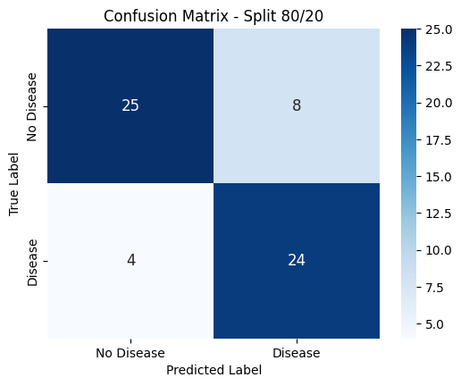
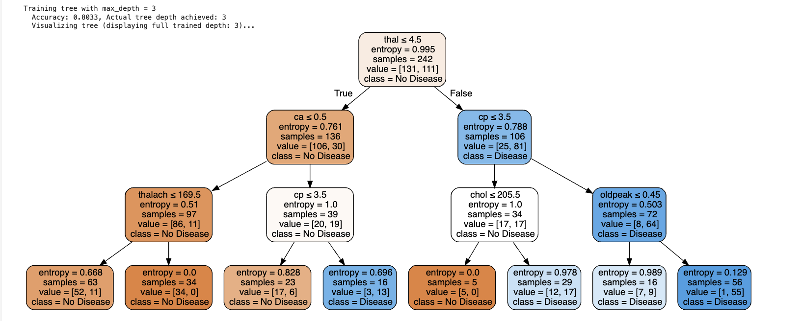
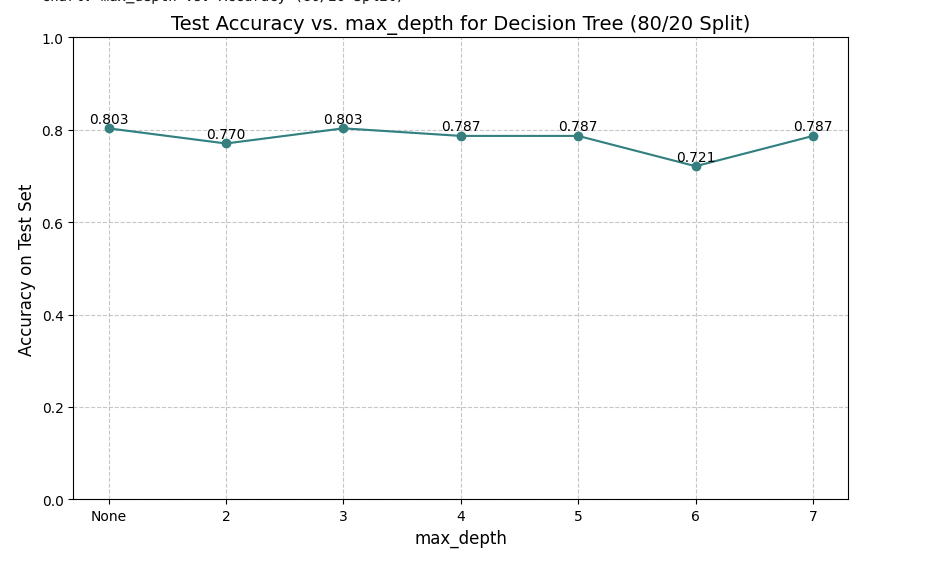
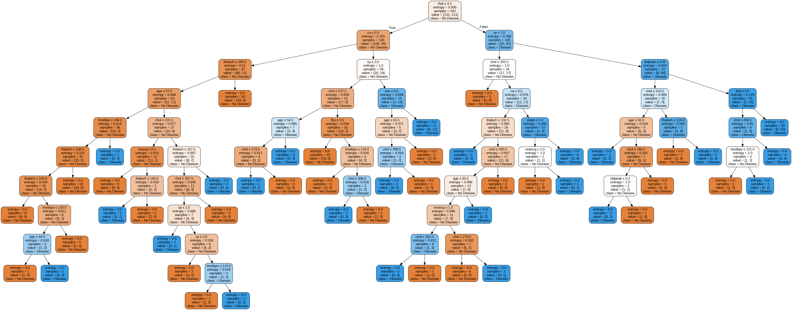

# Báo cáo Phân tích Dữ liệu Bệnh Tim

## 1. Mô tả và Tiền xử lý Dữ liệu Ban đầu

### Nguồn gốc và Mục đích
Bộ dữ liệu "Heart Disease" được thu thập từ UCI Machine Learning Repository (ID=45), với mục tiêu chính là xây dựng mô hình dự đoán sự hiện diện của bệnh tim ở bệnh nhân dựa trên 13 đặc trưng y tế và thông tin cá nhân. Tổng số mẫu trong bộ dữ liệu là **303**.

### Biến mục tiêu (`num`)
Biến mục tiêu gốc có các giá trị từ 0 (không bệnh) đến 4 (các cấp độ bệnh khác nhau). Để phù hợp với bài toán phân loại nhị phân của project, biến này đã được chuyển đổi thành:
- **0** cho "Không bệnh" (No Disease)
- **1** cho "Có bệnh" (Disease)

### Phân phối lớp của biến mục tiêu
Trước khi tiến hành chia tập dữ liệu, phân phối lớp của biến mục tiêu như sau:
- **Lớp "Không bệnh" (0)**: 164 mẫu (khoảng 54.13%)
- **Lớp "Có bệnh" (1)**: 139 mẫu (khoảng 45.87%)

> ****

**Nhận xét:** Bộ dữ liệu thể hiện sự phân bổ tương đối cân bằng giữa hai lớp, tạo điều kiện thuận lợi cho việc huấn luyện mô hình mà không bị thiên lệch quá nhiều về một lớp cụ thể.

### Xử lý giá trị thiếu
- Kiểm tra ban đầu cho thấy hai cột `ca` (number of major vessels colored by flourosopy) và `thal` (thalassemia) có chứa các giá trị thiếu (lần lượt là 4 và 2 giá trị NaN).
- Phương pháp điền giá trị thiếu bằng **giá trị trung vị (median)** của từng cột đã được áp dụng bằng cách sử dụng `SimpleImputer` từ `scikit-learn`. 
- Sau bước này, bộ dữ liệu đặc trưng `X` không còn giá trị thiếu.

---

## 2. Chuẩn bị Tập dữ liệu 
*(Thực hiện theo Section 2.1 trong Notebook)*

- Bộ dữ liệu đã được chia thành các tập huấn luyện (training) và tập kiểm tra (testing) theo **bốn tỷ lệ khác nhau**: 40/60, 60/40, 80/20, và 90/10.
- Quá trình chia được thực hiện bằng hàm `train_test_split` với:
  - `shuffle=True` để xáo trộn dữ liệu
  - `stratify=y` để đảm bảo tỷ lệ phân bổ của các lớp được duy trì đồng đều trong cả tập huấn luyện và tập kiểm tra

### Trực quan hóa phân phối lớp sau khi chia

> ****

**Nhận xét:** Các biểu đồ xác nhận rằng việc chia stratified đã thành công. Tỷ lệ phần trăm của lớp "Không bệnh" và "Có bệnh" trong từng tập huấn luyện và tập kiểm tra ở mỗi tỷ lệ chia đều xấp xỉ với tỷ lệ trong bộ dữ liệu gốc. Điều này đảm bảo tính đại diện của các tập dữ liệu con.

---

##  Xây dựng và Đánh giá Cây Quyết định
*(Thực hiện theo Sections 2.2 & 2.3 trong Notebook)*

### Mô hình
Các mô hình cây quyết định được xây dựng bằng `DecisionTreeClassifier` của `scikit-learn`, với:
- Tiêu chí: `criterion='entropy'` (Information Gain)
- Trong bước huấn luyện này, tham số `max_depth` không được giới hạn, cho phép cây phát triển đến độ sâu tối đa có thể

### Kết quả đánh giá tổng quan cho các tỷ lệ chia

| Tỷ lệ Chia (Huấn luyện/Kiểm tra) | Độ chính xác (Accuracy) | Độ sâu thực tế của cây |
|----------------------------------|-------------------------|------------------------|
| 40/60                           | 0.7253                  | 9                      |
| 60/40                           | 0.7295                  | 7                      |
| 80/20                           | 0.8033                  | 10                     |
| 90/10                           | 0.8065                  | 10                     |

### Phân tích chi tiết cho tỷ lệ chia 80/20

#### Báo cáo phân loại (Classification Report)
```
Classification Report:
              precision    recall  f1-score   support

  No Disease      0.862     0.758     0.806        33
     Disease      0.750     0.857     0.800        28

    accuracy                          0.803        61
   macro avg      0.806     0.807     0.803        61
weighted avg      0.811     0.803     0.803        61

Accuracy for split 80/20: 0.8033
```

#### Ma trận nhầm lẫn (Confusion Matrix)
> ****

#### Nhận xét (Insights)

**Độ chính xác tổng thể:** Với tỷ lệ chia 80/20, mô hình cây quyết định đạt độ chính xác tổng thể là **80.33%** trên tập kiểm tra.

**Precision:**
- Đối với lớp "No Disease": **0.862** - khi mô hình dự đoán một bệnh nhân không mắc bệnh, có 86.2% khả năng dự đoán đó là đúng
- Đối với lớp "Disease": **0.750** - 75% các trường hợp được dự đoán mắc bệnh là chính xác

**Recall (Độ bao phủ):**
- Đối với lớp "No Disease": **0.758**
- Đối với lớp "Disease": **0.857** - mô hình đã xác định đúng 85.7% trong tổng số bệnh nhân thực sự mắc bệnh

**F1-score:** Các giá trị F1-score (0.806 cho "No Disease" và 0.800 cho "Disease") thể hiện sự cân bằng tốt giữa precision và recall cho cả hai lớp.

**Phân tích lỗi:**
- **False Negatives (FN)**: 4 trường hợp - bệnh nhân thực sự có bệnh nhưng bị dự đoán là không bệnh
- **False Positives (FP)**: 8 trường hợp - bệnh nhân không bệnh bị dự đoán là có bệnh

>  Trong lĩnh vực y tế, FN thường là loại lỗi nghiêm trọng hơn FP, vì bỏ sót bệnh có thể dẫn đến hậu quả nặng nề. Mặc dù recall cho lớp "Disease" khá cao, việc giảm thiểu FN luôn là một mục tiêu quan trọng.

**So sánh các tỷ lệ chia:** Nhìn chung, độ chính xác có xu hướng cải thiện khi kích thước tập huấn luyện tăng. Các tỷ lệ chia 80/20 và 90/10 cho kết quả tốt hơn so với 40/60 và 60/40. Độ sâu của cây khi không giới hạn cũng khá lớn (từ 7 đến 10 tầng), cho thấy mô hình có khả năng học các mối quan hệ phức tạp trong dữ liệu.

### Trực quan hóa cây quyết định (Section 2.2)

Các cây quyết định đã được trực quan hóa bằng Graphviz. Do độ phức tạp của cây khi không giới hạn độ sâu, việc hiển thị toàn bộ cấu trúc trong notebook là không khả thi.

> ****

*Chú thích: Hình trên chỉ hiển thị 3 tầng đầu của cây quyết định huấn luyện trên split 80/20 để minh họa. Có thể thấy các đặc trưng như `thal`, `ca`, `cp` thường được sử dụng ở các nút gần gốc, gợi ý về tầm quan trọng của chúng.*

---

## 4. Ảnh hưởng của Độ sâu Cây đến Độ chính xác
*(Thực hiện theo Section 2.4 trong Notebook - Split 80/20)*

Để đánh giá ảnh hưởng của độ phức tạp mô hình, các cây quyết định đã được huấn luyện lại trên tập train/test 80/20 với các giá trị `max_depth` khác nhau: None (không giới hạn), 2, 3, 4, 5, 6, và 7.

### Bảng kết quả Accuracy và Độ sâu thực tế của cây

| max_depth | Accuracy | Actual Depth |
|-----------|----------|--------------|
| None      | 0.8033   | 10           |
| 2         | 0.7705   | 2            |
| 3         | 0.8033   | 3            |
| 4         | 0.7869   | 4            |
| 5         | 0.7869   | 5            |
| 6         | 0.7213   | 6            |
| 7         | 0.7869   | 7            |

### Biểu đồ Accuracy vs. Max Depth
> ****

### Nhận xét (Insights)

**Hiệu suất tối ưu:**
- Độ chính xác trên tập kiểm tra cao nhất (**0.8033**) đạt được khi `max_depth=None` (độ sâu thực tế là 10) và khi `max_depth=3`

**Underfitting:**
- Khi `max_depth=2`, độ chính xác là **0.7705** - có thể là trường hợp underfitting nhẹ, khi cây chưa đủ phức tạp để học hết các quy luật của dữ liệu

**Overfitting:**
- Tại `max_depth=6`, độ chính xác giảm xuống còn **0.7213** - có thể là dấu hiệu của overfitting. Mô hình lúc này có thể đã học cả nhiễu trong tập huấn luyện, làm giảm khả năng tổng quát hóa trên tập kiểm tra

**Lựa chọn tối ưu:**
- So sánh giữa `max_depth=3` và `max_depth=None`, cả hai đều cho độ chính xác tốt nhất
- Cây với `max_depth=3` đơn giản hơn đáng kể (độ sâu thực tế là 3 so với 10), do đó dễ diễn giải hơn và có thể là lựa chọn tốt hơn nếu ưu tiên tính giải thích của mô hình

**Khuyến nghị:**
- Sự biến động của accuracy cho thấy việc lựa chọn `max_depth` tối ưu là quan trọng và có thể cần các kỹ thuật như cross-validation để xác định một cách đáng tin cậy hơn trong thực tế

### Trực quan hóa cây quyết định (Section 2.4)

Các cây quyết định tương ứng với từng giá trị `max_depth` đã được tạo. Việc hiển thị toàn bộ các cây này, đặc biệt là cây với `max_depth=None`, là khó khăn trong khuôn khổ báo cáo.

> ****

*Chú thích: Hình trên minh họa cây quyết định được huấn luyện với max_depth=*

> ****

*Chú thích: Hình trên minh họa cây quyết định được huấn luyện không giới hạn độ sâu (max_depth=None), cho thấy độ phức tạp cao hơn.*

---

## 5. Kết luận cho Bộ dữ liệu Bệnh Tim

### Tóm tắt kết quả chính

Mô hình cây quyết định cho thấy **khả năng phân loại bệnh nhân mắc bệnh tim với độ chính xác tương đối tốt** trên bộ dữ liệu UCI Heart Disease, đặc biệt khi có đủ dữ liệu huấn luyện (ví dụ, split 80/20 hoặc 90/10 cho accuracy khoảng 80%).

### Những phát hiện quan trọng

**Về tham số mô hình:**
- Độ sâu của cây là một tham số quan trọng: cây quá nông có thể dẫn đến underfitting, trong khi cây quá sâu có thể overfitting
- `max_depth=3` mang lại hiệu suất tốt tương đương với cây mọc tự do (`max_depth=None`) nhưng có ưu điểm là **đơn giản và dễ diễn giải hơn**

**Về đặc trưng quan trọng:**
- Các đặc trưng y tế như `thal`, `ca`, `cp` thường xuyên được mô hình lựa chọn ở các cấp độ chia nhánh cao, nhấn mạnh **vai trò quan trọng** của chúng trong việc chẩn đoán

### Hạn chế và hướng cải thiện

**Về False Negatives:**
- Mặc dù recall cho lớp "Có bệnh" đạt mức khá, số lượng các trường hợp False Negative cần được chú ý
- Có thể cải thiện bằng các kỹ thuật nâng cao hơn trong các ứng dụng thực tế như:
  - Ensemble methods
  - Cost-sensitive learning
  - Threshold tuning

**Khuyến nghị:**
- Sử dụng cross-validation để xác định tham số tối ưu một cách đáng tin cậy
- Xem xét các phương pháp ensemble để cải thiện độ chính xác và giảm overfitting
- Trong ứng dụng thực tế, cần cân nhắc đặc biệt việc giảm thiểu False Negatives do tính chất quan trọng của việc phát hiện bệnh